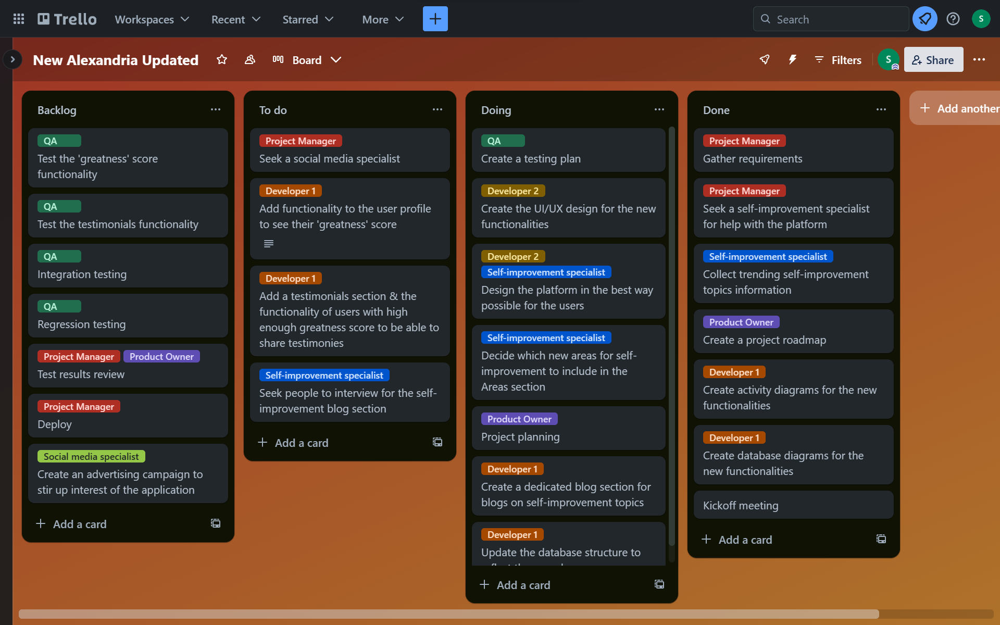
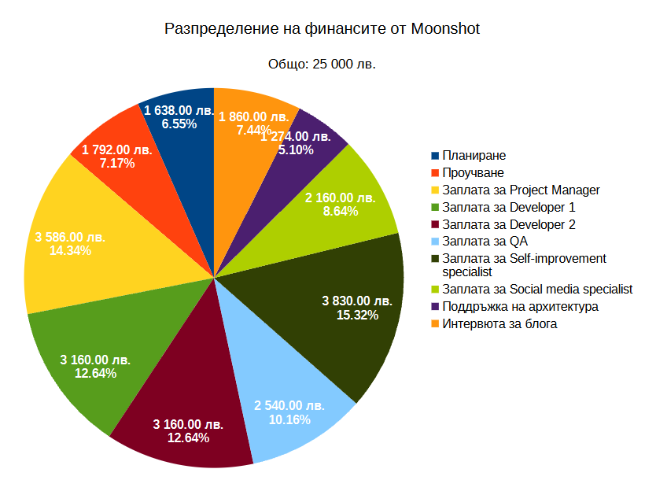

# Разпределение на задачите за проекта

Може да видите разпределението на задачите в Trello проекта на следния линк: [Разпределение на задачите в Trello](https://trello.com/invite/b/71u4Jcpa/ATTIe4dea5fd130ecbc38f5e7db35acc37cbB7E15298/new-alexandria-updated)

# Разпределение на финансите от Moonshot

| Разходи                                | Сума (лв.) |
| -------------------------------------- | ---------: |
| Планиране                              |       1638 |
| Проучване                              |       1792 |
| Заплата за Project Manager             |       3586 |
| Заплата за Developer 1                 |       3160 |
| Заплата за Developer 2                 |       3160 |
| Заплата за QA                          |       2540 |
| Заплата за Self-improvement specialist |       3830 |
| Заплата за Social media specialist     |       2160 |
| Поддръжка на архитектура               |       1274 |
| Интервюта за блога                     |       1860 |
| **Общо**                               | **25 000** |

